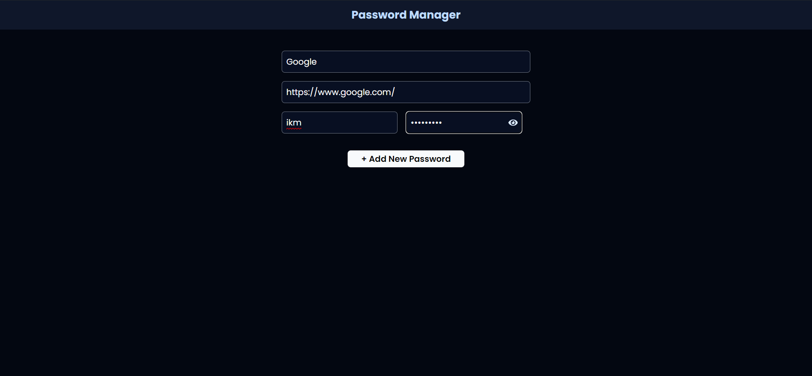
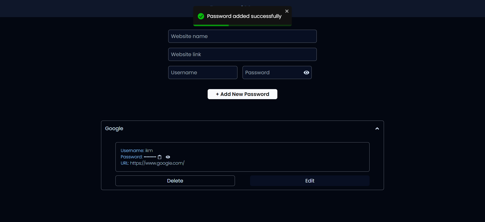
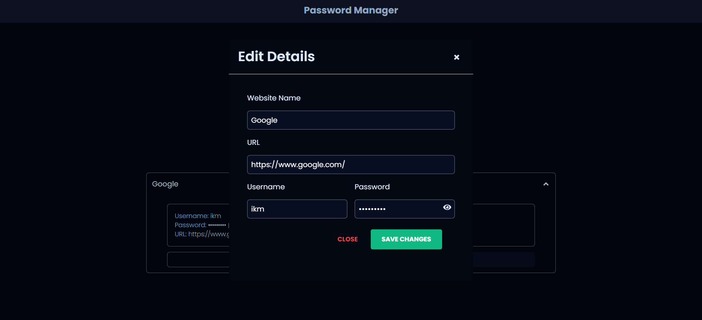

# Password Manager App

A simple password manager application built with React, designed to securely store and manage passwords.

## Table of Contents

- [Password Manager App](#password-manager-app)
  - [Table of Contents](#table-of-contents)
  - [Features](#features)
  - [Technologies Used](#technologies-used)
  - [Installation](#installation)
  - [Usage](#usage)
  - [Screenshot](#screenshot)
    - [Add password](#add-password)
    - [All password](#all-password)
    - [Edit password](#edit-password)

## Features

- **Add New Passwords**: Allows users to add new passwords with website details.
- **View Passwords**: Displays saved passwords with options to view, copy, and delete.
- **Edit Passwords**: Modal popup for editing existing passwords.
- **Copy to Clipboard**: Allows copying passwords to clipboard for easy usage.
- **Responsive Design**: Responsive layout for mobile and desktop.

## Technologies Used

- **React**: Frontend framework for building user interfaces.
- **React Icons**: Provides icons used for UI elements.
- **React Toastify**: Displays notification messages for actions like adding, copying, and deleting passwords.
- **Tailwind CSS**: Utility-first CSS framework used for styling.
- **Node.js**: Backend server environment.
- **Express**: Minimalist web framework for Node.js.
- **MongoDB**: NoSQL database for storing password data.

## Installation

1. **Clone the repository:**

2. **Install dependencies:**

    **Install backend dependencies**
   ```bash
   cd backend
   npm install
   ```

    **Install backend dependencies**
   ```bash
   cd frontend
   npm install
   ```

3. **Set up environment variables:**

   - Create a `.env` file in the backend directory.
   - Define DATABASE_URL in `.env` file
   - Define `BASE_URL` for backend API (e.g., `BASE_URL=http://localhost:5000/api/passwords`) in `frontend\src\App.jsx` line 8.

4. **Start the development server:**

    **To start backend server**
   ```bash
   cd backend
   npm start
   ```
    **To start frontend**
   ```bash
   cd frontend
   npm run dev
   ```

   This will start the React development server and your backend server.

## Usage

- **Adding Passwords**: Fill in the details in the input fields and submit the form to add a new password.
- **Viewing Passwords**: Click on the website name to expand and view details such as username, password, and URL.
- **Editing Passwords**: Click on the edit icon to modify existing passwords using the modal popup.
- **Deleting Passwords**: Click on the delete button to remove passwords from the list.
- **Copying Passwords**: Click on the clipboard icon next to the password to copy it to your clipboard.

## Screenshot

### Add password


### All password


### Edit password
